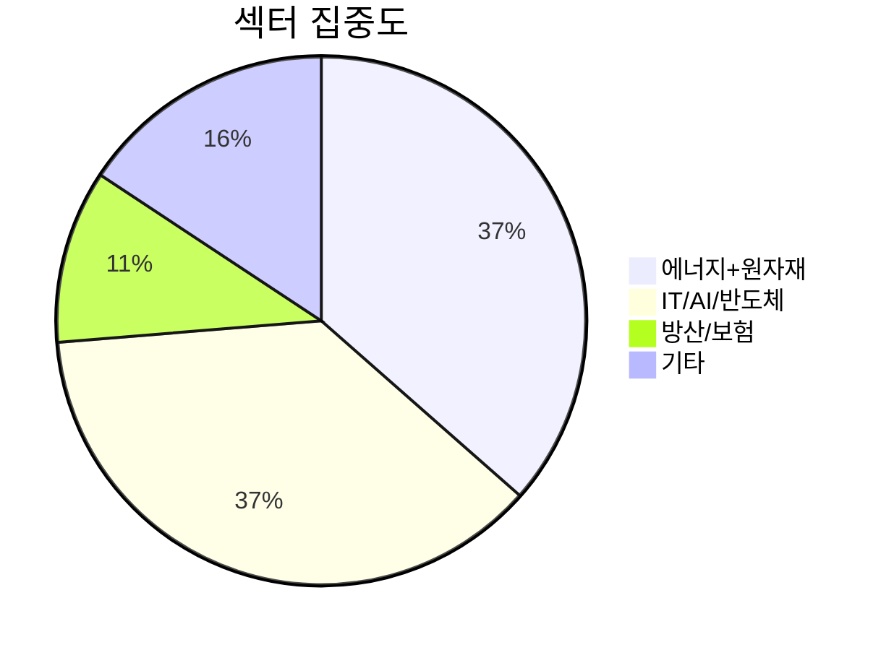

# 투자 보고서 — 2026-03-31 02:00 KST

## 레짐: Risk-Off (VIX 30.4)

VIX 30 이상. 시장이 공포 상태. 이 환경에서는 **방어적 전략**이 우선.

---

## 핵심 이슈 3가지

### 1. 관세 전쟁 격화
트럼프 행정부의 상호관세 4월 2일 발효 예정. 시장이 이미 반응 중 (VIX 30+).
- **직접 영향**: NVDA(-4.2%), GOOGL(-8.2%), 삼성전자(-6.6%), SK하이닉스(-15.6%)
- **수혜**: XOM(+40.6%), XLE(+15.6%) — 에너지 자급 테마

### 2. 원화 약세 1,518원
달러 강세 + 한국 정치 불확실성. USD/KRW 1,518원은 역사적 고점 영역.
- 달러 자산(포트폴리오 72%)의 원화 환산 이익이 주가 손실을 상쇄 중
- **USD 현금 $33,709** (₩51.2M)은 원화 약세에서 유리

### 3. 금리 환경 (US 10Y 4.33%)
연준 금리 인하 기대 후퇴. 고금리 장기화.
- 성장주(NVDA, GOOGL, NAVER) 압박 지속
- 가치주/에너지(XOM, WMB) 상대적 강세

---

## 포트폴리오 진단

**총 평가: ₩135.0M (매입 ₩137.0M, -1.5%)**
**USD 현금 포함: ₩186.2M**

### 잘한 것
- **에너지 비중 18.4%**: XOM +40.6%, XLE +15.6%. Risk-Off에서 에너지가 가장 강했음
- **달러 현금 보유**: ₩51.2M. 현재 환율에서 환차익 발생 중
- **분산**: 4개국, 14개 섹터. 집중 리스크 낮음

### 문제점

| 문제 | 종목 | 손실 | 비중 |
|------|------|------|------|
| **NAVER 최대 손실** | 035420 | -18.2% (-₩3.7M) | 14.8% |
| **SK하이닉스 급락** | 000660 | -15.6% (-₩646K) | 3.0% |
| **금/은 역행** | GLD/SLV | -9.3%/-9.6% | 18.1% |
| **IT 전반 약세** | GOOGL, NVDA, NAVER | -4~-18% | 32.0% |

### 구조적 리스크

**에너지+원자재(36.5%)와 IT/AI(37.2%)에 73% 집중.**
이 두 섹터가 동시에 하락하면 포트폴리오 급락.

---

## 액션 제안

### 지금 당장 (이번 주)

| 우선순위 | 액션 | 이유 |
|---------|------|------|
| **1** | NAVER 비중 축소 검토 | 14.8%는 과다. -18%에서 추가 하락 가능 |
| **2** | 관세 이벤트(4/2) 전 방어 | VIX 30+에서 추가 매수 자제. 현금 유지 |
| **3** | USD 현금 유지 | 원화 약세 지속 예상. 환전하지 마라 |

### 중기 (1-3개월)

| 액션 | 이유 |
|------|------|
| VIX 25 이하 시 IT 추가매수 | NVDA, GOOGL 펀더멘탈 건재. 공포에 사라 |
| GLD/SLV 인내 | 금리 인하 기대 재부상 시 반등. 장기 보유 |
| HK이노엔 유지 | +5.8%, 헬스케어 방어적 섹터 |

### 하지 말아야 할 것
- ❌ 패닉 매도 (전체 -1.5%는 양호한 수준)
- ❌ 원화 약세에 달러 매도 (달러가 방어막)
- ❌ VIX 30에서 공격적 매수 (공포 해소 안 됨)

---

## 시스템 상태

| 항목 | 상태 |
|------|------|
| 데이터 수집 | ✅ 가동 중 (주식/인덱스/FX/원자재/채권/암호화폐) |
| 텔레그램 봇 | ✅ 가동 중 |
| MCP 서버 | ✅ 34개 도구 |
| 포트폴리오 | ✅ 18종목 등록 |
| 고구마 | 🔲 1억 현금, 첫 매매 대기 |

---

*다음: 아침 뉴스 브리핑 (장 개장 전)*
